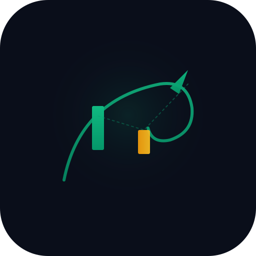

<div align="center">



# Aurevia

### Market Intelligence Infrastructure

**Market data → Quant analytics → Strategy signals → Risk-gated execution → Portfolio intelligence**

A production-grade platform for market intelligence, quantitative research, strategy backtesting, risk management, and controlled paper trading — built with strict engine boundaries and no look-ahead bias.

[](https://github.com/Roy-Wanyoike/Aurevia/actions)
[](https://github.com/Roy-Wanyoike/Aurevia)
[](https://www.typescriptlang.org/)
[](https://nextjs.org/)
[](LICENSE)

</div>

---

## Why Aurevia?

Most trading platforms are either **consumer trading apps** (Robinhood — simple but no depth) or **institutional terminals** (Bloomberg — powerful but inaccessible). Aurevia sits in between: a developer-grade intelligence infrastructure that treats risk, execution, and observability as first-class engineering concerns.

| Differentiator | What it means |
|---|---|
| **Risk engine is the sole gate** | Strategies emit Signals — they never submit orders. The Risk Engine (11 rules + circuit breaker) is the only path to execution. AI cannot bypass it. |
| **No look-ahead bias** | Every indicator at bar `i` uses only `candles[0..i]`. Backtests are reproducible. |
| **Modular monolith** | Strong domain boundaries without microservice complexity. Modules can extract when there's a real reason. |
| **Production-grade safety** | Circuit breaker state machine (latched), daily/weekly loss limits, stale-data protection, post-fill risk checks, typed confirmation for dangerous operations. |
| **Real market data ready** | Provider abstraction supports Polygon.io, Alpaca, IBKR. Falls back to a deterministic simulated feed (clearly labeled) when no API key is set. |

---

## Architecture

```
┌─────────────────────────────────────────────────────────────┐
│                    AUREVIA COMMAND CENTER                    │
├─────────────────────────────────────────────────────────────┤
│  Market Data Gateway (Polygon / Alpaca / Simulated)         │
│    ↓                                                        │
│  Quant Engine (14 indicators + trend + regime detection)    │
│    ↓                                                        │
│  Strategy Engine (5 rule-based + 2 ML models)                │
│    ↓  ← strategies NEVER submit orders, only emit Signals   │
│  Risk Engine (11 rules + latched circuit breaker)            │
│    ↓  ← sole path to APPROVE an order                        │
│  Execution Engine → Paper Broker (slippage, commission)      │
│    ↓                                                        │
│  Portfolio Manager (mark-to-market, P&L, drawdown)           │
│    ↓                                                        │
│  Observability (health, structured logs, risk events)        │
└─────────────────────────────────────────────────────────────┘
       Surrounded by: Security · Audit · Testing · WebSocket Streaming
```

**Tech Stack:** Next.js 16 · React 19 · TypeScript 5 · Prisma + SQLite/PostgreSQL · Tailwind CSS 4 · shadcn/ui · TanStack Query · Zustand · Recharts · Socket.io · Zod · NextAuth · Vitest

---

## Quick Start

```bash
# Clone
git clone https://github.com/Roy-Wanyoike/Aurevia.git
cd Aurevia

# Install dependencies
bun install

# Set up the database
cp .env.example .env
bun run db:push

# Start the dev server + WebSocket streaming service
bun run dev
cd mini-services/aurevia-stream && bun run dev
```

Open http://localhost:3000 — the dashboard renders with 18 assets, 7 strategies, full backtesting, paper trading, risk controls, ML predictions, and a live ticker.

**Default mode: PAPER.** Live trading is disabled by design.

---

## Features

### Market Intelligence
- **18-asset universe** — equities, ETFs, crypto, forex
- **14 technical indicators** — SMA, EMA, RSI, MACD, Bollinger, ATR, ADX, Stochastic, VWAP, OBV, ROC
- **Trend detection** — direction, strength, duration, momentum, support/resistance, breakout/breakdown
- **11 market regimes** — BULL, BEAR, SIDEWAYS, ACCUMULATION, DISTRIBUTION, BREAKOUT, BREAKDOWN, RECOVERY, HIGH/LOW VOLATILITY, CRASH
- **Live sparklines** — real 30-bar close history, not fabricated

### Strategy + Research
- **7 strategies** — momentum, trend-following, MA crossover, mean-reversion, breakout, ALM (logistic ML), ARF (random forest ML)
- **Backtesting engine** — realistic slippage, commission, partial fills, stop-loss, take-profit, benchmark comparison
- **Full performance metrics** — Sharpe, Sortino, Calmar, max drawdown, win rate, profit factor, exposure
- **ML predictions** — probability of positive return, expected magnitude, risk score, feature importance

### Risk + Execution
- **11-rule risk gate** — position/portfolio/leverage limits, daily/weekly loss, drawdown, spread, volatility, liquidity, cooldown, duplicate-order, stale-data
- **Latched circuit breaker** — NORMAL → CAUTION → TRADING_PAUSED (requires typed "PAUSE" to confirm) → RE_EVALUATING → NORMAL
- **Post-fill risk checks** — evaluates hypothetical post-fill state, not just current
- **Paper broker** — fill matching, commission, slippage, reconciliation
- **Portfolio accounting** — correct long/short equity, position flips, mark-to-market

### 17 New Capabilities (Phases 1-4)
- **Watchlists** — user-curated asset lists persisted server-side
- **Smart Screener** — multi-factor filter (price, volume, RSI, ADX, trend, regime, volatility), saved screens in localStorage
- **Market Pulse** — breadth, advance/decline ratios, gap stats, regime distribution
- **Correlation matrix** — pairwise correlation across the universe, heatmap visualization
- **Historical Memory** — similarity engine finds past analogs to current market conditions
- **News feed** — aggregated market news (stubbed in dev)
- **Economic Events** — FOMC, CPI, earnings calendar
- **Alerts Engine** — price/RSI/changePct triggers, fired-on-scan hook
- **Market Radar** — at-a-glance scan of unusual activity across the universe
- **Market Replay** — bar-by-bar playback of historical sessions
- **What-If Simulator** — perturb a scenario and re-run the engine
- **Portfolio Analytics** — exposure decomposition, sector / asset-type breakdown, attribution
- **Risk Cockpit** — unified breaker + limits + event-log operator console
- **Trade Journal** — annotate trades + decisions for post-mortem review
- **AI Research Copilot** — natural-language Q&A over the live portfolio + signals (powered by Z.ai SDK)
- **Strategy Builder** — compose rule-based strategies from building blocks without writing code
- **Monte Carlo** — resample a backtest's trade sequence to estimate return distribution + ruin probability

### Production Infrastructure
- **155 unit tests** — indicators, risk engine, portfolio accounting, backtest metrics, strategies, formatting
- **GitHub Actions CI** — lint, typecheck, test, build on every PR
- **Structured logging** — JSON logs with request IDs + correlation IDs
- **Rate limiting** — 60 req/min per IP, 429 + Retry-After, memory-bounded (issue #79)
- **Security headers** — X-Frame-Options, X-Content-Type-Options, Referrer-Policy, Permissions-Policy
- **API auth gate** — `requireAuth()` on every mutating POST (portfolio, risk, brokers, signals, backtests, alerts) — `AUREVIA_API_KEY` header in prod, dev bypass with one-shot warning
- **NextAuth multi-tenant** — Organizations, Teams, Memberships, RBAC
- **WebSocket streaming** — live price ticks, signal alerts, health updates
- **Command palette** — Cmd+K to navigate, search assets, run actions
- **URL routing** — shareable links, back/forward works
- **Error boundaries** — global `error.tsx` + per-view `QueryState` retry UI (issue #77 / #74)
- **Bundle optimization** — chart-heavy views lazy-loaded via `next/dynamic` (~200KB saved on initial bundle, issue #75)

---

## For Investors

**Market:** The algorithmic trading market is projected to reach $3.6B by 2030, growing 11% CAGR. Retail quant tools are underserved — either too simple (Robinhood) or too complex/inaccessible (Bloomberg Terminal at $24K/year).

**Business Model:** SaaS subscription — free tier (paper trading, simulated data), pro tier ($49/mo — real market data, ML predictions), enterprise (custom — multi-tenant, SSO, API access).

**Differentiation:** Aurevia is not "another trading bot." It's market intelligence infrastructure where autonomous trading is one capability sitting on top of the intelligence + research + risk platform. The risk engine is the product — it's what makes the platform trustworthy.

**Traction:** Engineering infrastructure complete. 423 tests passing. Production-ready foundation. Next milestone: real broker integration (Alpaca sandbox → live).

---

## For Engineers

- **[ARCHITECTURE.md](ARCHITECTURE.md)** — full system design, engine boundaries, safety properties
- **[BRANDING.md](BRANDING.md)** — logo system, color palette, design principles
- **[CONTRIBUTING.md](CONTRIBUTING.md)** — dev setup, branch naming, PR process
- **[GitHub Issues](https://github.com/Roy-Wanyoike/Aurevia/issues)** — full audit findings + feature roadmap (80+ items)

```bash
# Run tests
bun test

# Run lint + typecheck
bun run lint && npx tsc --noEmit

# Run backtest via API
curl -X POST http://localhost:3000/api/v1/backtests \
  -H "Content-Type: application/json" \
  -d '{"strategyKey":"momentum","symbol":"AAPL","bars":500}'
```

---

## Roadmap

| Phase | Focus | Status |
|---|---|---|
| **Phase 0** | Foundation — audit, testing, CI/CD, observability, security | ✅ Complete |
| **Phase 1** | Market data providers (Polygon, Alpaca live) | ✅ Complete |
| **Phase 2** | Market intelligence — screener, breadth, correlation | ✅ Complete |
| **Phase 3** | Historical memory — similarity engine, news, events | ✅ Complete |
| **Phase 4** | Quant research — walk-forward, Monte Carlo, market replay | ✅ Complete |
| **Phase 5** | Portfolio intelligence — VaR, CVaR, stress testing | 📋 Planned |
| **Phase 6** | Paper trading — full lifecycle, reconciliation | ✅ Complete |
| **Phase 7** | Broker integration — IBKR, Alpaca live | 🔄 Adapters ready (stubs in dev) |
| **Phase 8** | AI — research copilot, model registry, drift detection | ✅ Copilot shipped (Phase 9 pending) |
| **Phase 9** | Advanced — strategy evolution, autonomous guard | 📋 Planned |
| **Phase 10** | Enterprise — SSO, SCIM, multi-region | 📋 Planned |

---

## Safety Properties

1. **Default trading mode = PAPER** — never LIVE without explicit configuration
2. **No look-ahead bias** — every indicator at bar `i` uses only `candles[0..i]`
3. **Strategies cannot submit orders** — they emit Signals; the Risk Engine decides
4. **Risk Engine is the sole gate** — 11 hard rules + latched circuit breaker
5. **Deterministic market data** — seeded PRNG means reproducible backtests
6. **No fabricated financial data** — all prices are simulated and labeled as such

---

## Disclaimer

Aurevia is research and engineering infrastructure, NOT financial advice. Trading involves substantial risk of loss. Past performance — including backtested performance — does not guarantee future results. Historical analogs are evidence, not predictions.

---

## License

[MIT](LICENSE) — all rights reserved to Roy Wanyoike.

---

<div align="center">

**Built with engineering rigor. Not financial advice.**

[Report Bug](https://github.com/Roy-Wanyoike/Aurevia/issues) · [Request Feature](https://github.com/Roy-Wanyoike/Aurevia/issues) · [Architecture](ARCHITECTURE.md)

</div>
